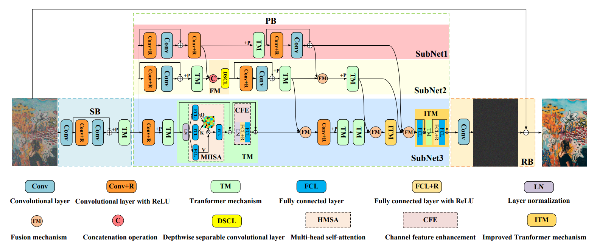
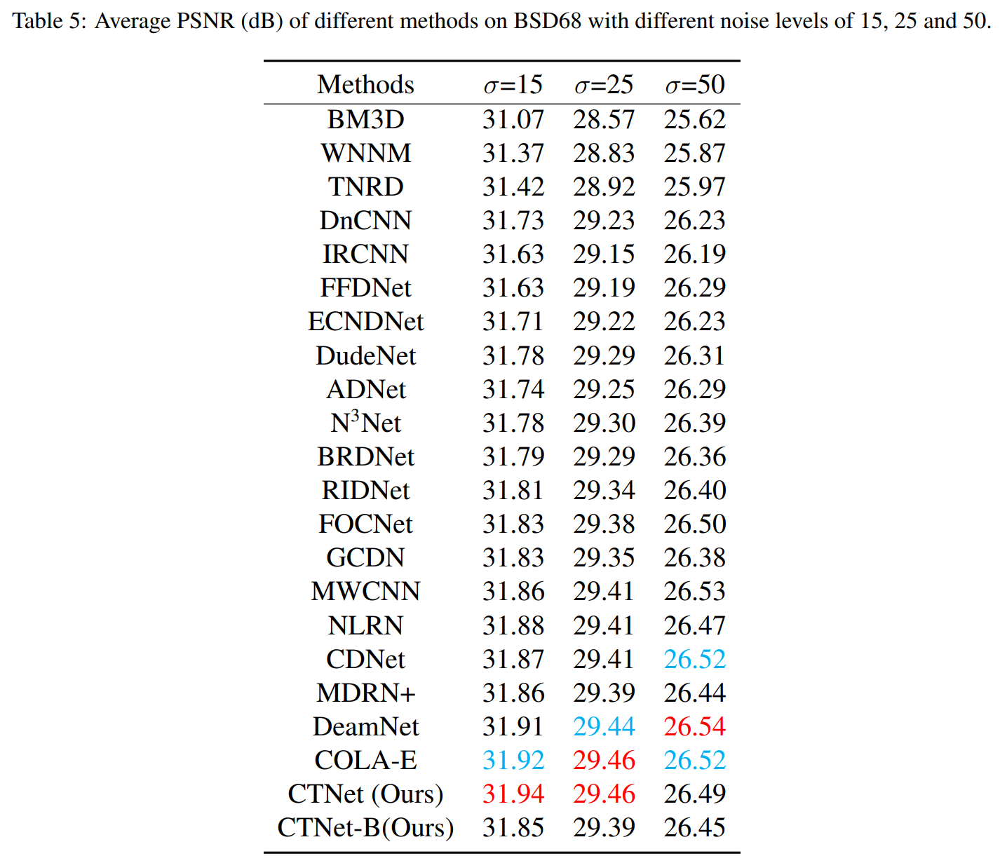
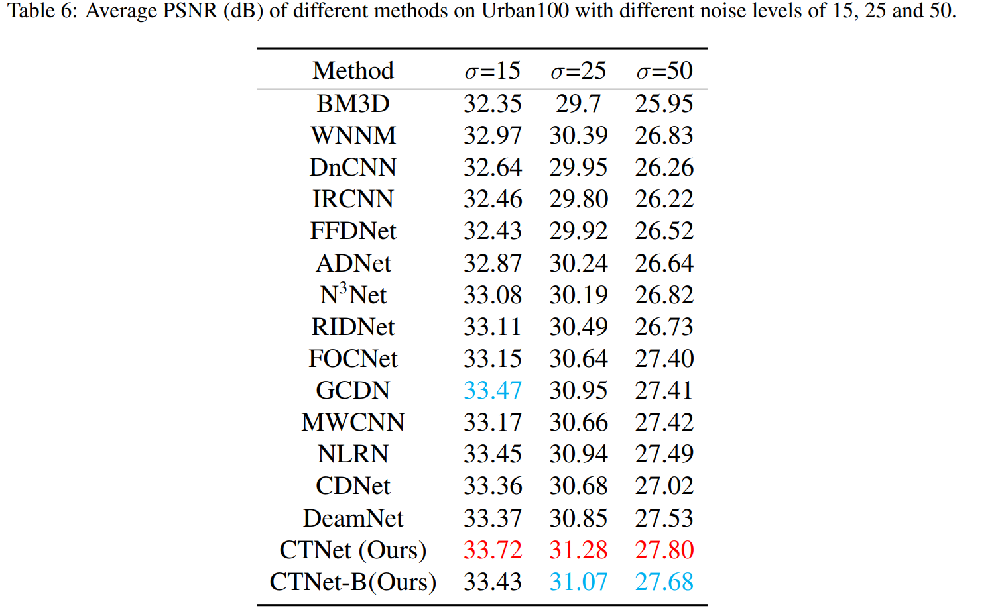
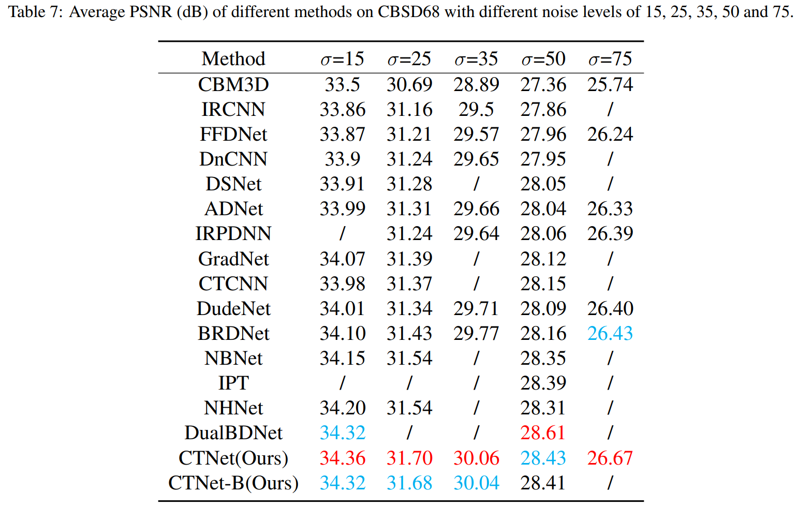
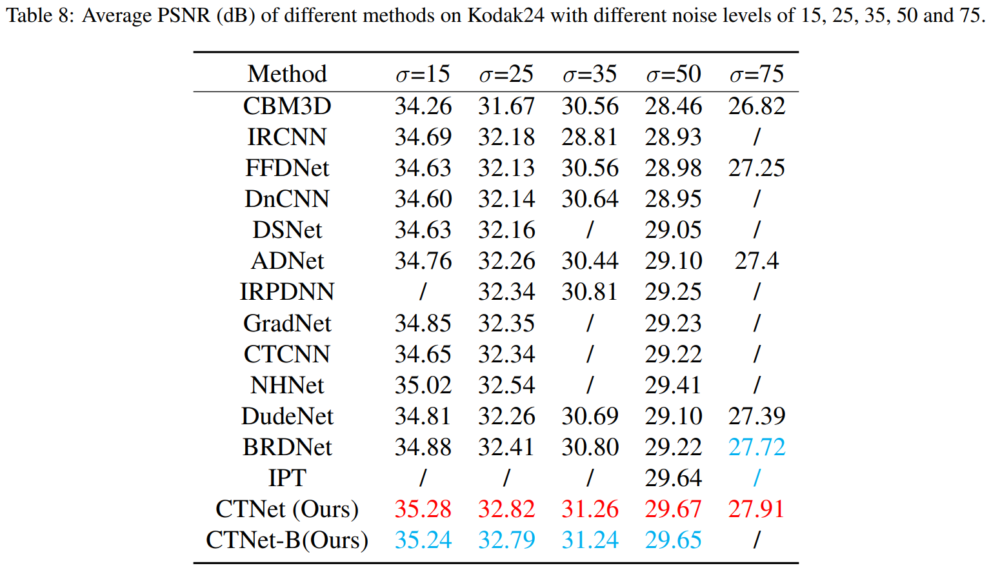
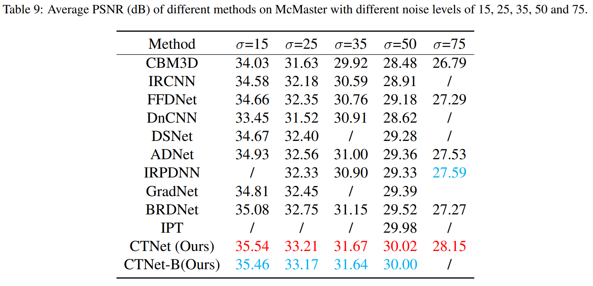
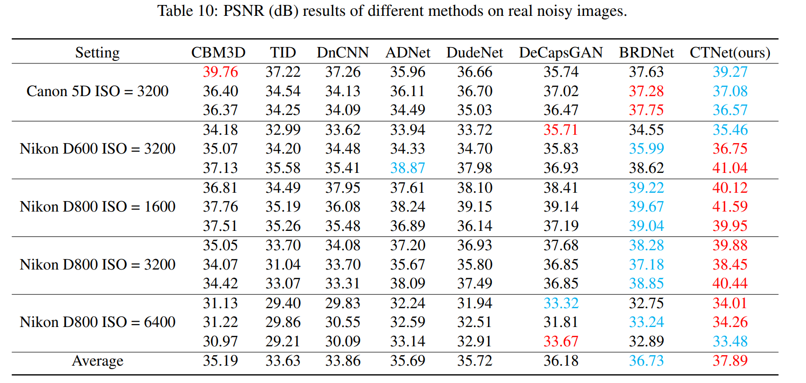
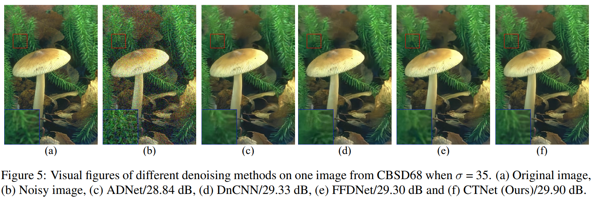
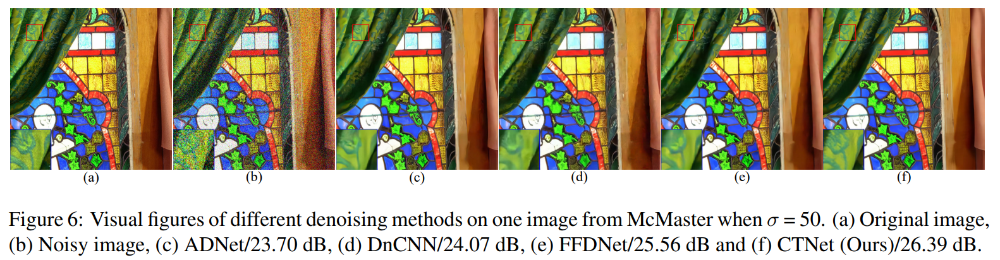

## This paper as well as A cross Transformer for image denoising is conducted by Chunwei Tian, Menghua Zheng, Wangmeng Zuo, Shichao Zhang, Yanning Zhang, Chia-Wen Lin. This  paper is accepted by the information fusion (IF:18.6).

## Its abstract is shown as follows.

## Deep convolutional neural networks (CNNs) depend on feedforward and feedback ways to obtain good performance in image denoising. However, how to obtain effective structural information via CNNs to efficiently represent given noisy images is key for complex scenes. In this paper, we propose a cross Transformer denoising CNN (CTNet) with a serial block (SB), a parallel block (PB), and a residual block (RB) to obtain clean images for complex scenes. A SB uses an enhanced residual architecture to deeply search structural information for image denoising. To avoid loss of key information, PB uses three heterogeneous networks to implement multiple interactions of multi-level features to broadly search for extra information for improving the adaptability of an obtained denoiser for complex scenes. Also, to improve denoising performance, Transformer mechanisms are embedded into the SB and PB to extract complementary salient features for effectively removing noise in terms of pixel relations. Finally, a RB is applied to acquire clean images. Experiments illustrate that our CTNet is superior to some popular denoising methods in terms of real and synthetic image denoising. It is suitable to mobile digital devices, i.e., phones. Codes can be obtained at https://github.com/hellloxiaotian/CTNet.

## Requirements (Pytorch)

#### Pytorch 1.10.2

#### Python 3.8

#### openCv for Python

## DataSet

### Training datasets

#### The training dataset of the CBSD500 images is downloaded at https://pan.baidu.com/s/1ou2mK5JUh-K8iMu8-DMcMw (baiduyun) or https://drive.google.com/open?id=1S1_QrP-fIXeFl5hYY193lr07KyZV8X8r (google drive)

#### The training dataset of the DIV2K can be obtained at https://data.vision.ee.ethz.ch/cvl/DIV2K/

#### The training dataset of the Flickr2K can be obtained at http://cv.snu.ac.kr/research/EDSR/Flickr2K.tar

#### The training dataset of the WED can be obtained at https://ece.uwaterloo.ca/~k29ma/exploration/

#### Test dataset of BSD68 is downloaded at https://drive.google.com/file/d/1_fw6EKne--LVnW0mo68RrIY-j6BKPdSp/view?usp=sharing (google drive)

#### Test dataset of Set12 is downloaded at https://drive.google.com/file/d/1cpQwFpNv1MXsM5bJkIumYfww8EPtlkWf/view?usp=sharing (google drive)

#### Test dataset of CBSD68 is downloaded at https://drive.google.com/file/d/1lxXQ_buMll_JVWxKpk5fp0jduW5F_MHe/view?usp=sharing (google drive)

#### Test dataset of Kodak24 is downloaded at https://drive.google.com/file/d/1F4_mv4oTXhiG-zyG9DI4OO05KqvEKhs9/view?usp=sharing (google drive)

#### The training dataset of real noisy images is downloaded at https://drive.google.com/file/d/1IYkR4zi76p7O5OCevC11VaQeKx0r1GyT/view?usp=sharing and https://drive.google.com/file/d/19MA-Rgfc89sW9GJHpj_QedFyo-uoS8o7/view?usp=sharing （google drive）

#### The test dataset of real noisy images is downloaded at https://drive.google.com/file/d/17DE-SV85Slu2foC0F0Ftob5VmRrHWI2h/view?usp=sharing (google drive)

## Command

### Test

Download model file at https://pan.baidu.com/s/1BkKo9udW1wCn1ALCYyl_QA (passwd: ipg6)

cd main

#### Gray noisy images

python trian.py --mode test --model_name gtd --rgb_range 1 --n_colors 1 --sigma 25 --num_layers 1 --n_GPUs 1 --GPU_id 3 --test_dataset Set12 --model_file_name ../model_zoo/ctnet/g25/model_sigma25.pth

#### Gray blind denoising

python trian.py --mode test --model_name gtd --rgb_range 1 --n_colors 1 --sigma 50 --num_layers 1 --n_GPUs 1 --GPU_id 3 --test_dataset Set12 --model_file_name ../model_zoo/ctnet/denoising_b/g/model_sigma100.pth

#### Color noisy images

python trian.py --mode test --model_name gtd --rgb_range 1 --n_colors 3 --sigma 25 --num_layers 1 --n_GPUs 1 --GPU_id 3 --test_dataset CBSD68 --model_file_name ../model_zoo/ctnet/c25/model_sigma25.pth

#### Color blind denoising

python trian.py --mode test --model_name gtd --rgb_range 1 --n_colors 3 --sigma 50 --num_layers 1 --n_GPUs 1 --GPU_id 3 --test_dataset CBSD68 --model_file_name ../model_zoo/ctnet/denoising_b/c/model_sigma100.pth

### Train

cd main

python trian.py --mode train --n_pat_per_image 48 --batch_size 8 --lr 0.0002 --model_name gtd --rgb_range 1 --n_colors 1 --sigma 25 --num_layers 1 --n_GPUs 1 --GPU_id 0

## 1. Network architecture of CTNet.

## 2. Average PSNR (dB) of different methods on Set12 with noise levels of 15, 25 and 50.

## 3. Average PSNR (dB) of different methods on BSD68 with noise levels of 15, 25 and 50.

## 4. Average PSNR (dB) of different methods on Urban100 with noise levels of 15, 25 and 50.

## 5. Average PSNR (dB) of different methods on CBSD68 with noise levels of 15, 25, 35, 50 and 75.

## 6. Average PSNR (dB) of different methods on Kodak24 with noise levels of 15, 25, 35, 50 and 75.

## 7. Average PSNR (dB) of different methods on McMaster with noise levels of 15, 25, 35, 50 and 75.

### 8. Average PSNR (dB) of different methods on real noisy images

### 9. Average PSNR (dB) results of different methods for real noisy images on SIDD and Mayo dataset.

## 10. Visual results of BSD68 with noise level of 50. 

## 11. Visual results of Set12 with noise level of 25. 

## 12. Visual results of CBSD68 with noise level of 35. 

### 13. Visual results of McMaster with noise level of 50. 

## You can cite this paper by the following ways.

